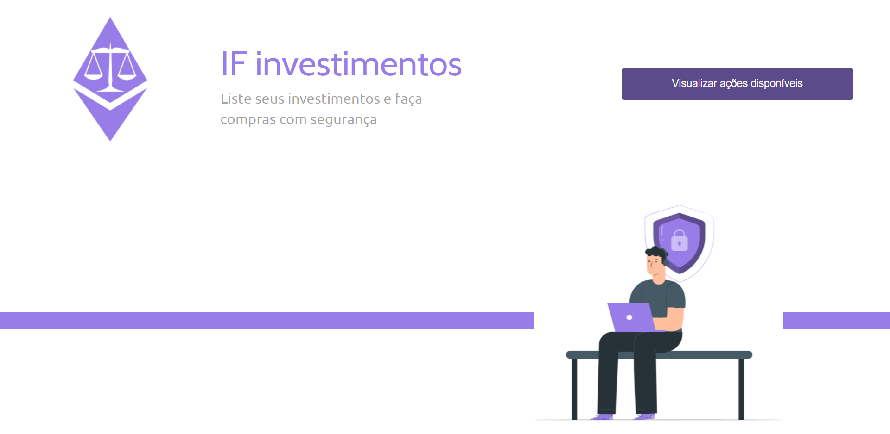
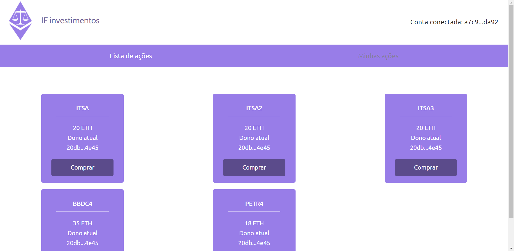
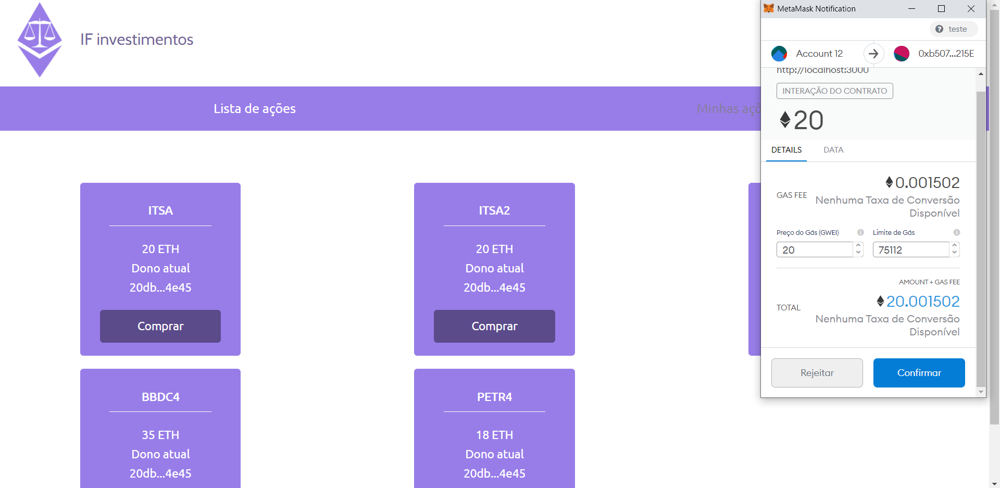
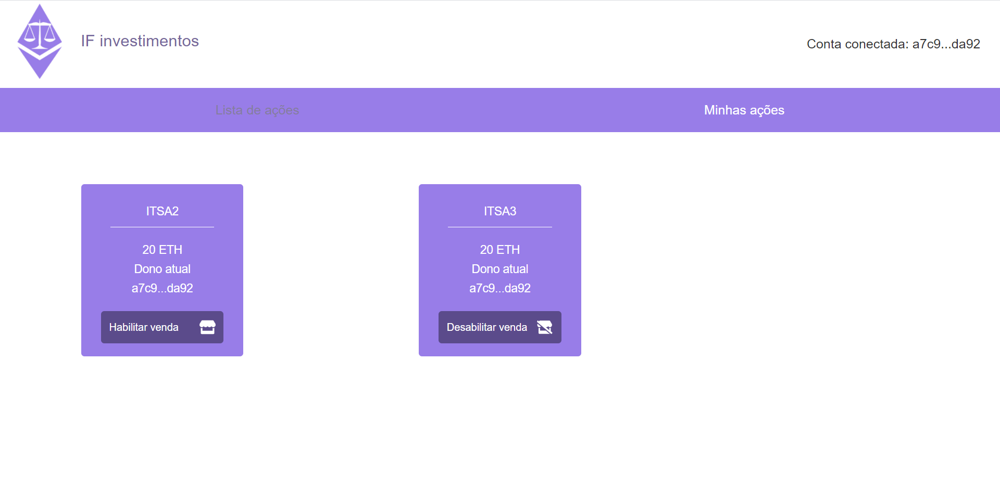

# Atividade Final - Disciplina Blockchain

## Ferramentas utilizadas
- Truffle
- Ganache
- Metamask

## Como utilizar
```bash
# Após clonar o repositório, instale as dependências necessárias

npm install

# Para realizar o deploy do contrato em uma blockchain local usando o Ganache, basta rodar o comando

truffle migrate 

# ou

truffle migrate --reset 

# Para visualizar uma versão de desenvolvimento da aplicação
npm run dev

```

## Capturas de tela

### Tela inicial
<p align="center">
  
</p>

### Home
<p align="center">
  
</p>

### Compra de ação
<p align="center">
  
</p>

### Ações do usuário

<p align="center">
  
</p>
